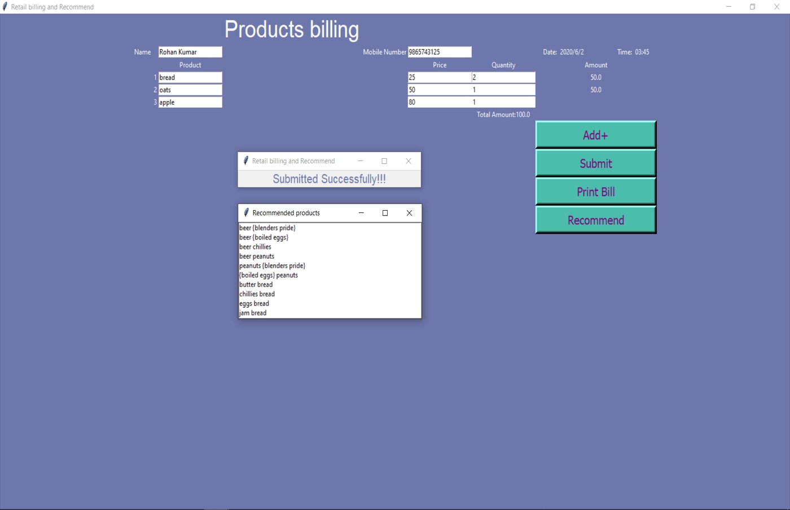

## E Commerce Profitibility and Recommendation System
This is a GUI based Real-time billing application and the recommendation system to recommend the different products that are likely to be sold together with attractive features added to it.
### Project Set Up and Installation
1) Clone this repository<br>
```
git clone `https://github.com/bhatiaharshit07/E-Commerce-Profitibility-and-Recommendation-System.git
```
2) Download required python modules


### Demo
1) Run the billing_recommend.py file. <br>
Example
```
C:/Users/Harshit/anaconda3/python.exe e:/Github/E-Commerce-Profitibility-and-Recommendation-System/billing_recommend.py
```

